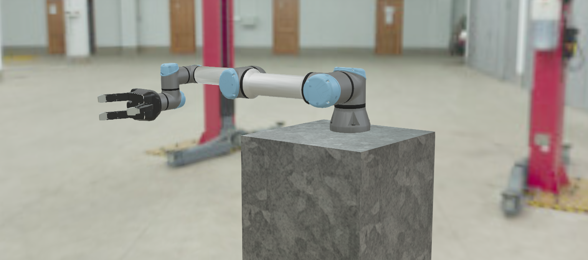
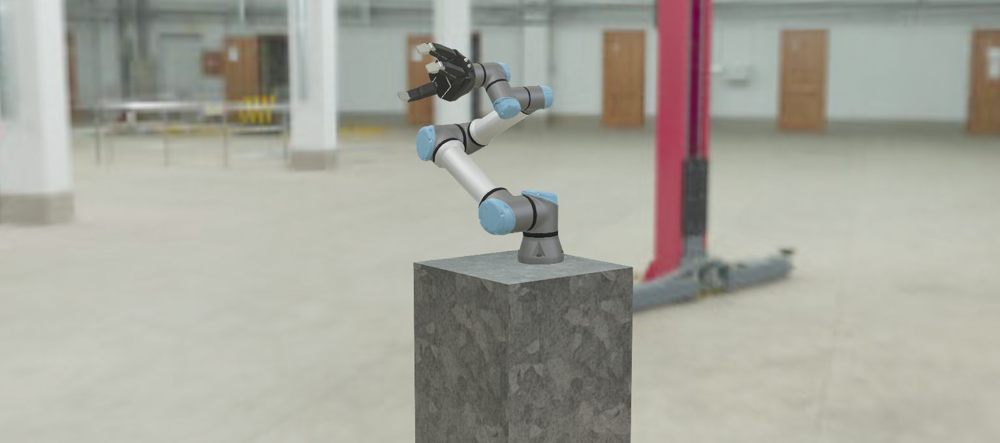

# MimicMyArmMotionUniversalRobot
Easy, plug-and-play code. A custom-made robotic manipulator (realistic) [cobots UR-5 and UR-10 from universal robots] will mimic your arm motion using your webcam:)

Please install the following:  
  
  * [OpenCV-Python](https://pypi.org/project/opencv-python/)
  * [mediapipe](https://pypi.org/project/mediapipe)
  * [Webots Robot Simulator](https://cyberbotics.com/doc/guide/installing-webots)
  
That's pretty much it:)  
  
  Just open the Webots world from [UR5.wbt](./UR5) and run it in the Webots robot simulator.
